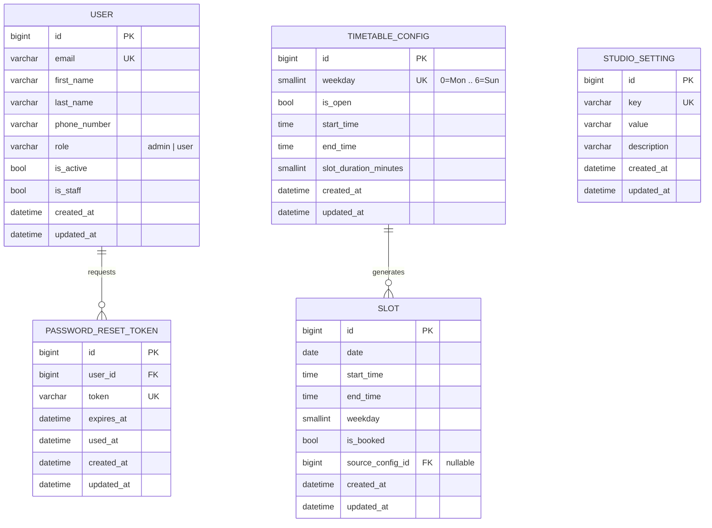

# Database Schema

Living document. Updated at the end of every phase that changes the
database. Do not let this drift from `manage.py showmigrations` /
the actual model files under `backend/apps/*/models.py`.

## ER Diagram

## Database Tables

### `accounts_user`

| Field | Type | Notes |
|---|---|---|
| id | BigAutoField (PK) | |
| email | EmailField | unique, `USERNAME_FIELD` |
| first_name | CharField(150) | blank allowed |
| last_name | CharField(150) | blank allowed |
| phone_number | CharField(32) | blank allowed |
| role | CharField(16) | choices: `admin`, `user`; default `user` |
| is_active | Boolean | default `True` |
| is_staff | Boolean | default `False`; gates Django admin only, not app role |
| created_at | DateTime | auto |
| updated_at | DateTime | auto |

**Constraints:** `email` unique.
**Indexes:** PK on `id`; unique index on `email`.
**Business rules:** `role` defaults to `user` on self-registration; only
promoted to `admin` out-of-band (Django admin or a future admin-only
endpoint) — never client-settable at registration.

### `accounts_password_reset_token`

| Field | Type | Notes |
|---|---|---|
| id | BigAutoField (PK) | |
| user_id | FK → accounts_user | `on_delete=CASCADE` |
| token | CharField(128) | unique, `secrets.token_urlsafe(48)` |
| expires_at | DateTime | default now + `PASSWORD_RESET_TOKEN_TTL_HOURS` (env-configurable) |
| used_at | DateTime | null until consumed |
| created_at / updated_at | DateTime | auto |

**Constraints:** `token` unique.
**Business rules:** single-use (`used_at` set on consumption); expired or
used tokens are rejected by `reset_password_with_token`.

### `core_studio_setting`

Generic admin-configurable key/value store. Introduced in Phase 3 so
studio-wide values (starting with the slot generation horizon) are never
hardcoded in application code — every future "configurable from the admin
panel" value can be added here without a schema change.

| Field | Type | Notes |
|---|---|---|
| id | BigAutoField (PK) | |
| key | CharField(100) | unique, e.g. `slot_generation_horizon_days` |
| value | CharField(255) | stored as text, cast by the typed accessor (`StudioSetting.get_int`, etc.) |
| description | CharField(255) | blank allowed, admin-facing hint |
| created_at / updated_at | DateTime | auto |

**Constraints:** `key` unique.
**Business rules:** absence of a row falls back to the code-defined default
in `apps.core.settings_keys` (e.g. `slot_generation_horizon_days` defaults
to 30, clamped 7–365) — the app never crashes on a missing setting.

### `classes_timetable_config`

The **only** thing an admin configures for scheduling. One row per weekday,
seeded by migration `classes_app.0002_seed_timetable_config` with the
studio's initial default (9:00 AM–9:00 PM, 60-minute slots, all 7 days
open) and edited thereafter — never created or deleted through the app.

| Field | Type | Notes |
|---|---|---|
| id | BigAutoField (PK) | |
| weekday | PositiveSmallInteger | unique; 0=Monday … 6=Sunday |
| is_open | Boolean | default `True`; closed days generate no slots |
| start_time | Time | working start time |
| end_time | Time | working end time; must be after `start_time` when `is_open` |
| slot_duration_minutes | PositiveSmallInteger | length of each generated slot |
| created_at / updated_at | DateTime | auto |

**Constraints:** `weekday` unique (exactly 7 rows, one per weekday).
**Business rules:** saving a row triggers `classes_app.signals` →
`services.regenerate_weekday(weekday)`, which deletes and regenerates only
that weekday's **future, unbooked** slots. Past slots and booked slots are
never touched, regardless of what changes here.

### `classes_slot`

System-generated bookable time-windows, derived from `TimetableConfig`.
Never created directly by an admin or via a public "create slot" endpoint —
only `apps.classes_app.services.generate_slots()` (and its callers:
`regenerate_weekday`, `regenerate_all`, the `generate_slots` management
command, and the horizon-update endpoint) writes rows here.

| Field | Type | Notes |
|---|---|---|
| id | BigAutoField (PK) | |
| date | Date | |
| start_time | Time | |
| end_time | Time | |
| weekday | PositiveSmallInteger | denormalized from `date` for fast per-weekday queries/deletes |
| is_booked | Boolean | default `False`; not yet set by any code path — reserved for the booking module (later phase) |
| source_config_id | FK → classes_timetable_config, nullable | `on_delete=SET_NULL`; traceability only, not required for regeneration logic |
| created_at / updated_at | DateTime | auto |

**Constraints:** unique on (`date`, `start_time`) — `unique_slot_per_date_start_time`; this is also what makes generation idempotent (`get_or_create` on the same key).
**Indexes:** `idx_slot_date` on `date`; `idx_slot_date_booked` on (`date`, `is_booked`) for the regeneration query (`date >= today AND is_booked = False`).
**Business rules:**
- Slots are only ever generated for `date >= today` (server-local date via `timezone.localdate()`), out to `StudioSetting.slot_generation_horizon_days`.
- Regeneration (weekday change, horizon change, or explicit resync) deletes only rows matching `date >= today AND is_booked = False` for the affected scope, then re-runs generation — so it is safe to call repeatedly and never destroys history or booked slots.
- Generation is additive-only per run: `get_or_create` means a second run against unchanged config creates zero new rows and modifies nothing (idempotent).

## Relationships

- `accounts_user` 1 — N `accounts_password_reset_token`
- `classes_timetable_config` 1 — N `classes_slot` (nullable FK; a slot survives its source config being deleted, though config rows are never deleted in normal operation)

## Update Log

| Date | Phase | Change |
|---|---|---|
| 2026-07-31 | Phase 2 — Authentication | Initial schema: `accounts_user`, `accounts_password_reset_token`, plus `token_blacklist` tables from `djangorestframework-simplejwt` (unmanaged by app code). |
| 2026-08-01 | Phase 3 — Timetable Module | Added `core_studio_setting` (generic admin-configurable settings), `classes_timetable_config` (per-weekday working hours + slot duration, seeded 9AM–9PM/60min for all 7 days), `classes_slot` (system-generated bookable windows, unique on date+start_time, idempotent generation). No changes to existing accounts tables. |
