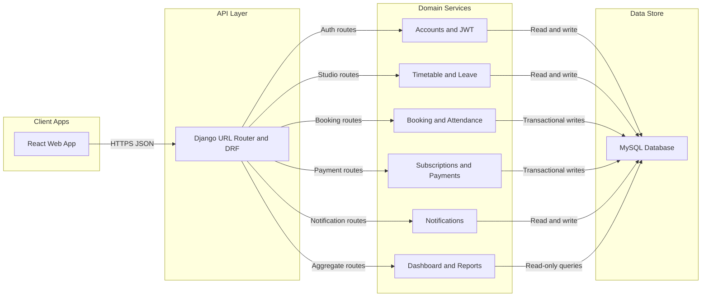
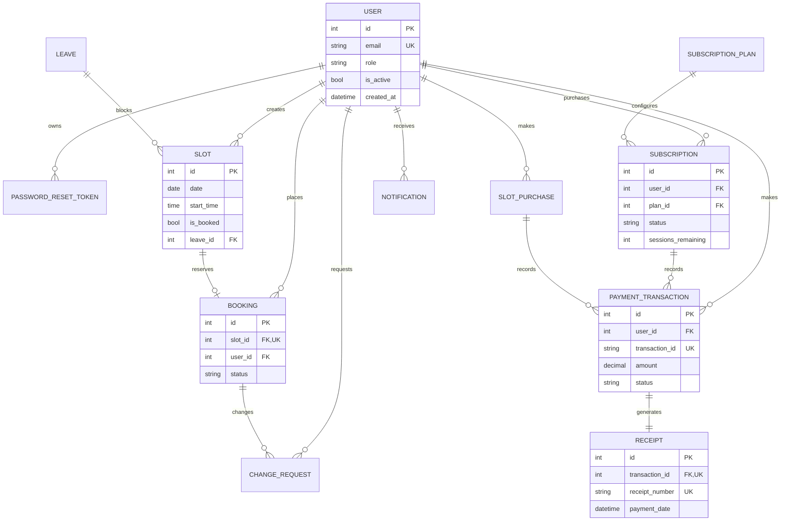

# EKAM Yoga Project Overview

The system is a modular monolith: one React/Vite application serves the
public homepage, member account area, and admin dashboard; one Django/DRF
application owns authentication, timetable, leave, booking, payment,
notification, dashboard, and reporting domains.

The backend is the source of truth for permissions, booking state, attendance,
subscription balances, payment history, receipts, and audit records. The
frontend uses feature modules and shared layout/design tokens. Dashboard and
reports endpoints are read-only aggregates and do not duplicate domain write
logic.

## Production review status

- Transactions and row locks protect booking, transfer/reschedule, attendance,
  and subscription mutations.
- Admin-only aggregates and reports use `IsAuthenticated` plus `IsAdminRole`.
- Database indexes cover booking slots, active users, change-request dates,
  payment status/date queries, and existing user/status access patterns.
- The production settings enforce HTTPS redirects, secure cookies, HSTS,
  content-type sniffing protection, referrer policy, and clickjacking defense.
- The responsive dashboard sidebar collapses labels on narrow screens while
  preserving the existing navigation and visual system.

## Architecture diagram

## Entity relationship diagram

